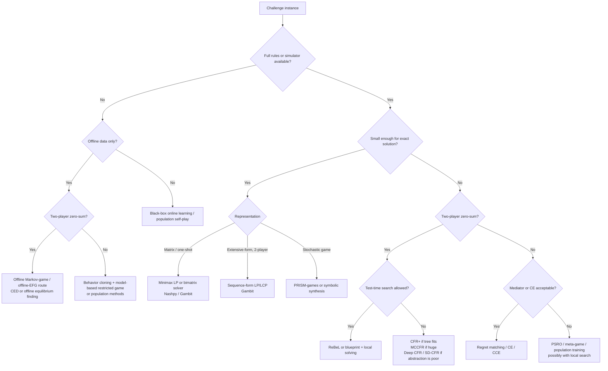
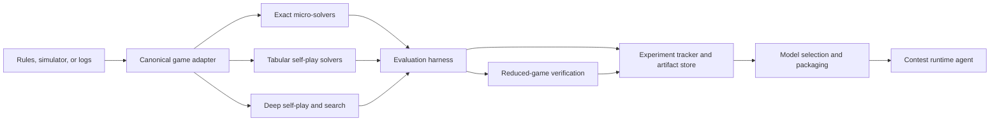
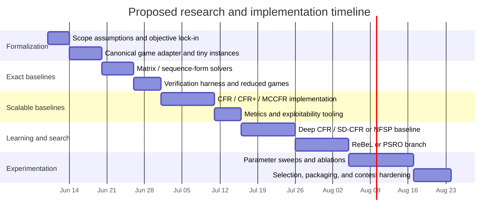

# Solving an Unspecified Game-Theory Programming Challenge

## Executive summary

Because the challenge is unspecified, the highest-value way to proceed is not to commit prematurely to a single algorithm, but to scope the problem into one of a few structural classes and then specialize aggressively. The key branches are: small finite normal-form or bimatrix games, which are exact-solver territory; two-player zero-sum extensive-form games with perfect recall, which are the canonical domain of sequence-form LP/LCP methods and CFR-family algorithms; multiplayer or nonzero-sum games, where exact Nash computation quickly becomes computationally hard and correlated-equilibrium or population-based methods often become the practical target; and stochastic or partially observable stochastic games, where exact symbolic tools work only at small scale and learned/self-play methods become necessary. Zero-sum matrix games can be solved efficiently via linear programming; two-player extensive-form games with perfect recall admit compact sequence-form representations; but computing Nash equilibria in general multiplayer games is PPAD-complete, and imperfect-information games do not admit a Bellman operator in the usual sense. citeturn33search4turn18view0turn33search0turn17view3

If I had to optimize for the strongest default stack under uncertainty, I would build a layered system: a canonical game interface; exact micro-solvers for tiny induced games; a scalable tabular self-play solver; and an optional deep/search layer. In practice, this means OpenSpiel as the experimental substrate, Gambit or Nashpy for exact verification on reduced games, PRISM-games for small symbolic stochastic-game synthesis if the domain is Markovian, and then one of three scalable paths: CFR+/MCCFR for large two-player zero-sum imperfect-information problems, ReBeL if search at training and test time is allowed, or PSRO-style population methods if the game is multiplayer or general-sum. OpenSpiel is particularly useful because it already supports simultaneous and sequential games, perfect and imperfect information, zero-sum and general-sum settings, and includes implementations of CFR, MCCFR, Deep CFR, NFSP, exploitability tools, PSRO, and AlphaZero-style methods. Gambit covers finite strategic and extensive games and supports Nash and QRE analysis. PRISM-games extends probabilistic model checking to stochastic multiplayer games, including concurrent stochastic games and equilibrium properties. citeturn10search4turn19view0turn19view1turn19view2turn19view3turn18view3turn18view4

For solver choice, the priority order is straightforward. If the hidden challenge is a small exact problem, use LP/LCP or sequence form and stop. If it is a large two-player zero-sum imperfect-information problem, start with CFR+ if the tree fits in memory, otherwise external-sampling or outcome-sampling MCCFR, and then test Deep CFR, SD-CFR, or ReBeL if abstraction is poor or search helps. If it is multiplayer or general-sum, exact Nash should usually be treated as a calibration baseline only; practical targets are correlated equilibrium, coarse correlated equilibrium, restricted-game meta-equilibria, or robust self-play policies over a population. Regret matching converges empirically to correlated equilibria, and correlated equilibria can be computed in polynomial time for broad classes of succinct multiplayer games, whereas general Nash equilibrium is substantially harder. citeturn9search1turn9search2turn26view3turn17view0turn27view0turn28view0turn33search0

My default implementation recommendation is therefore: first formalize the problem as an extensive-form or stochastic game; second, build exact verification on tiny instances; third, establish a tabular baseline with exploitability or regret-based metrics; fourth, add deep/self-play or population methods only after the tabular baseline is trustworthy; and fifth, if the leaderboard metric is head-to-head tournament score rather than exploitability, explicitly evaluate exploitative and population-based variants rather than assuming the “most equilibrium-like” agent will score best. This staged approach is consistent with the literature’s progression from exact solvers, to CFR-family methods, to deep counterfactual regret minimization, RL-plus-search, and population methods for large games. citeturn18view0turn26view3turn16view3turn28view0turn20search3

## Problem scoping and formal definitions

The problem statement leaves several load-bearing details unspecified. Those details determine not only which algorithms are appropriate, but also what “solving” means.

| Aspect | Unspecified | Reasonable alternatives | Consequence for algorithm choice |
|---|---|---|---|
| Player count | Yes | Two-player; three-player; many-player | Exact Nash is realistic mainly for small two-player instances; multiplayer usually pushes toward CE/PSRO/population methods |
| Utility structure | Yes | Zero-sum; constant-sum; general-sum; mixed cooperative-competitive | Zero-sum enables minimax/LP/CFR theory; general-sum changes both complexity and evaluation |
| Representation | Yes | Matrix game; extensive-form game; stochastic game; POSG | Matrix-game solvers differ radically from EFG/POSG solvers |
| Information | Yes | Perfect information; imperfect information; partial observation with public/private signals | Imperfect information rules out plain backward induction and standard Bellman-style planning |
| Timing | Yes | Simultaneous move; turn-based sequential; leader-follower commitment | Simultaneous-move stochastic games and Stackelberg variants need distinct solution concepts |
| Chance/stochasticity | Yes | Deterministic; chance nodes; exogenous stochastic transitions | Requires expectation handling, sampling, or symbolic stochastic-game tools |
| Access model | Yes | Full rules and simulator; black-box environment; offline log dataset | Determines whether exact planning, self-play, or offline equilibrium-finding is viable |
| Action/state size | Yes | Small discrete; combinatorial; very large discrete; continuous approximations | Governs whether tabular methods remain feasible |
| Evaluation metric | Yes | Nash exploitability; NashConv; CE regret; head-to-head win rate; leaderboard score | The competition metric may not match the theoretical objective |

For a finite normal-form game, the canonical model is \(G=(N,(A_i)_{i\in N},(u_i)_{i\in N})\), where \(N\) is the player set, \(A_i\) is each player’s action space, and \(u_i(a_1,\dots,a_n)\) is the payoff. Nash’s 1950 and 1951 papers established mixed-strategy equilibrium existence for finite games. If the challenge is truly one-shot and strategic-form, this is the right abstraction. citeturn11search0turn11search3

For an extensive-form game, the right object is a tuple such as \(G=(N,H,Z,P,\sigma_c,\{\mathcal I_i\},u)\): histories \(H\), terminal histories \(Z\), a player function \(P\) assigning the actor at each nonterminal history, chance policy \(\sigma_c\), information partitions \(\mathcal I_i\), and terminal utilities \(u_i(z)\). Perfect recall is the critical structural assumption behind sequence-form compactness and most CFR guarantees. In perfect-recall two-player games, realization plans over sequences yield a representation whose size is linear rather than exponential in the game tree. citeturn18view0turn1search4

For stochastic games or Markov games, the model becomes \(G=(\mathcal S,\{A_i\},T,\{r_i\},\gamma)\), where the next-state distribution \(T(s' \mid s,a)\) depends on state and joint action. Shapley’s stochastic games formalized the dynamic zero-sum case; Littman’s Markov-game formulation brought this viewpoint into multi-agent learning. If observations are partial, the natural model is a partially observable stochastic game, where each player receives observation signals rather than the full state. citeturn13search0turn13search2turn13search1

The main objective should also be treated as unspecified. If the game is two-player zero-sum, the clean target is a Nash equilibrium or an \(\varepsilon\)-equilibrium, measured by exploitability or NashConv. If the game is general-sum or multiplayer, a correlated equilibrium or coarse correlated equilibrium may be more computationally realistic and may align better with contest-style scoring. If the challenge rewards welfare or collective performance, social welfare or Pareto efficiency may matter more than Nash stability. If the timing structure includes commitment by one side, a Stackelberg objective is more appropriate than simultaneous-move Nash. OpenSpiel explicitly includes exploitability computation, Stackelberg equilibrium tooling, and CE-related dynamics; correlated-equilibrium theory originates with Aumann, and regret matching gives a simple adaptive route to correlated equilibrium. citeturn10search0turn15search8turn19view0turn9search0turn9search1

For a precise optimization target, I recommend defining the following objective tuple before coding any serious solver:  
\[
\text{Target} = (\text{solution concept},\ \text{performance metric},\ \text{wall-clock budget},\ \text{memory budget},\ \text{model access},\ \text{test-time search allowance}).
\]
In practice, almost every solver decision in the literature depends on some subset of that tuple. CFR-family methods are strongest for approximate Nash in two-player zero-sum imperfect-information games; ReBeL is strongest when RL and search can be combined; population methods such as PSRO become attractive when exact equilibrium structure is too hard or too restrictive. citeturn26view3turn28view0turn20search3

If off-equilibrium-path robustness matters—for example, when opponents are noisy, boundedly rational, or the contest environment perturbs policies—then equilibrium refinements can matter. Recent work has studied learning extensive-form perfect equilibria, which address trembling-hand style off-path behavior that ordinary Nash equilibrium can leave underspecified. That is not the default target unless the challenge strongly suggests it, but it is a reasonable refinement if off-path failures are visibly costing score. citeturn5search6

## Solver landscape and selection

The easiest way to avoid overengineering is to choose the solver family by structure first and by scale second: exact small-game methods, no-regret methods for large two-player zero-sum EFGs, population/meta-game methods for multiplayer or general-sum problems, and stochastic-game or offline-RL methods when the environment is Markovian or data-only. That decomposition mirrors the literature and the tooling ecosystem. citeturn18view0turn26view3turn20search3turn18view4



For exact solution on small structured games, the first checkpoint is whether the instance is really normal-form or can be reduced to one. Two-player zero-sum matrix games are efficiently solvable by linear programming; bimatrix games admit classical pivoting and enumeration methods such as Lemke–Howson, though worst-case complexity is poor; and extensive two-player games with perfect recall admit sequence-form representations and compact LCP or LP formulations. Gambit is the natural exact-solver platform here, while Nashpy is a lightweight Python option for two-player strategic-form games. citeturn33search4turn18view0turn18view3turn25search0turn25search3

For large two-player zero-sum imperfect-information extensive-form games, the default family remains CFR and its descendants. CFR minimizes counterfactual regret locally at information sets and guarantees that vanishing average regret implies an approximate Nash equilibrium in self-play. Vanilla CFR is full-tree and memory heavy but theoretically clean. CFR+ has the same asymptotic convergence rate as CFR, but in practice dramatically reduces computation time and was central to the solution of heads-up limit Texas Hold’em. MCCFR replaces full traversals with sampled traversals, preserving convergence while making large-tree training practical. If the game tree is large but still model-driven, this is the core family to test first. citeturn26view3turn27view0turn0search1turn17view0

If abstraction is brittle or the state space is too large for tabular representation, the natural next step is a function-approximation solver. NFSP was an early scalable end-to-end method for learning approximate Nash equilibria without handcrafted domain abstractions. Deep CFR then moved CFR itself into the function-approximation regime, avoiding manual abstraction and outperforming NFSP in large poker games; SD-CFR later simplified Deep CFR and improved empirical performance by avoiding the extra average-strategy network. In practice, these methods are attractive when you have simulator access, large observation spaces, and no strong reason to believe that manual abstraction will preserve strategically critical distinctions. citeturn16view2turn16view3turn3search4

If search at training time and test time is allowed, ReBeL is the most important modern reference point. ReBeL generalizes AlphaZero-style RL-plus-search to imperfect-information settings through public-belief-state search and provable convergence in two-player zero-sum games. That makes it the strongest research-grade choice when the challenge is large, hidden-information, and tactically deep, and when per-move compute is large enough to support local solving. If your problem is actually perfect-information, AlphaZero or MuZero-style planning becomes the appropriate simplification. citeturn28view0turn8search0turn8search1

For multiplayer or general-sum games, solver choice changes fundamentally. Exact Nash is generally too hard to make the center of gravity of the system unless the restricted game is tiny. Correlated equilibrium and coarse correlated equilibrium become attractive because they are often easier to compute or approximate, especially via no-regret dynamics, and because they remain meaningful in multiplayer settings. If a mediator interpretation is acceptable, regret matching is the cleanest path; if not, the most practical architecture is usually a restricted-game or policy-population method such as PSRO, which repeatedly trains approximate best responses and solves a meta-game. Recent PSRO survey work frames it precisely as a scalable bridge between classical equilibrium computation and large-scale learning. citeturn9search1turn9search2turn20search3turn20search12

If the challenge is multiplayer, partially observable, and too large for principled per-state solving, then the strongest practical inspiration comes from two directions. One is Pluribus-style blueprint populations plus local depth-limited solving, which succeeded in six-player no-limit poker. The other is DeepNash-style model-free self-play, which learned Stratego through self-play without search and used Regularized Nash Dynamics to stabilize convergence toward approximate equilibrium behavior. These methods matter because they show how to remain competitive when exact equilibrium computation is out of reach and when search is either too costly or too brittle. citeturn2search2turn28view0turn29view0

For stochastic games and POSGs, there are two distinct subcases. If the state space is small and symbolic, PRISM-games is a serious exact-analysis option and supports concurrent stochastic games and equilibria-based properties. If the game is large and model-free, solver choice depends on the utility structure: zero-sum Markov games can sometimes use minimax or exploitability-based methods, while general-sum stochastic games may require Nash-Q-style methods or population methods. Nash Q-learning is theoretically interesting but relies on solving stage-game Nash equilibria during learning and converges only under restrictions on the encountered stage games, so it is better treated as a baseline or a small-domain branch rather than a primary scalable solution. citeturn18view4turn20search2turn20search5

Recent theory worth including in a serious ablation suite includes mirror-descent style algorithms and bandit-feedback last-iterate methods. Predictive Blackwell approachability connects regret matching and mirror descent; Magnetic Mirror Descent provides strong optimization structure for two-player zero-sum games and quantal response equilibria; Local and Adaptive Mirror Descents in Extensive-Form Games give \(\tilde O(T^{-1/2})\) convergence under sampling; and recent ICML 2025 work gives finite-time last-iterate convergence guarantees under bandit feedback in two-player zero-sum imperfect-information EFGs. These are not yet the default industrial stack, but they are excellent candidates if you want a research-forward entry rather than only reproducing the 2015–2020 mainstream. citeturn22search1turn22search0turn30view0turn23search11

## Complexity and comparative analysis

Two facts should dominate the design. First, exact small-game solvers are indispensable as truth or near-truth generators, because without them you cannot calibrate exploitability, equilibrium distance, or implementation correctness. Second, past a certain scale, the effective complexity bottleneck is not asymptotic iteration count alone but the product of branching factor, horizon, information-set count, and evaluation budget. That is exactly why the literature moved from normal-form and sequence-form methods, to tabular regret minimization, to sampling, then to deep approximation and population methods. citeturn18view0turn26view3turn17view0turn16view3turn20search3

### Exact and tabular candidate solvers

| Solver | Best-fit class | Time profile | Space profile | Convergence or guarantee | Core assumptions | Primary source |
|---|---|---:|---:|---|---|---|
| Minimax LP | Two-player zero-sum matrix games | Polynomial in matrix input size | \(O(mn)\) payoff storage plus LP overhead | Exact equilibrium/value | Explicit matrix, zero-sum | Daskalakis et al. summary of LP tractability for zero-sum games citeturn33search4 |
| Lemke–Howson / support enumeration | Two-player bimatrix games | Often fast on small games, exponential worst case | \(O(mn)\) | Finds one Nash equilibrium in bimatrix games | Two players, strategic form | Lemke–Howson paper; Nashpy docs citeturn1search1turn25search3 |
| Sequence-form LP | Two-player zero-sum extensive-form games | Polynomial in sequence-form input size | Linear in sequence variables and sparse payoff structure | Exact equilibrium | Perfect recall, explicit game tree | Koller–Megiddo–von Stengel; von Stengel summary citeturn18view0turn1search4 |
| Sequence-form LCP | Two-player nonzero-sum extensive-form games | Smaller than normal form, but pivoting can still be exponential worst case | Linear in sequence variables | Exact equilibrium on small/medium instances | Perfect recall, two players | Koller–Megiddo–von Stengel citeturn18view0 |
| Regret matching | Correlated equilibrium in normal-form games | \(O(\sum_i |A_i|)\) update per round on explicit games | Regret vector storage | Empirical play converges to CE | Repeated-play setting, explicit actions | Hart & Mas-Colell; Papadimitriou–Roughgarden for succinct cases citeturn9search1turn9search2 |
| CFR | Large two-player zero-sum imperfect-information EFGs | Full-tree traversal each iteration | \(O(\sum_I |A(I)|)\) regrets + average strategy | Average regret \(O(1/\sqrt{T})\); approximate Nash from average strategy | Two-player zero-sum, perfect recall | Zinkevich et al. citeturn26view2turn26view3 |
| CFR+ | Same as CFR, larger scale | Same asymptotic rate as CFR, much faster in practice | Similar to CFR; engineering improvements critical | Sound, major practical speedups | Same as CFR | Bowling et al.; Tammelin citeturn27view0 |
| External / outcome-sampling MCCFR | Huge EFGs where full traversal is too expensive | Sampled subtree per iteration instead of full tree | Same tabular policy/regret storage as CFR | Probabilistic convergence; regret bounds scale like \(O(\sqrt{T})\) | Simulator or generative model, two-player zero-sum | Lanctot et al.; Deep CFR summary of MCCFR bound citeturn0search1turn17view0 |
| Local / adaptive OMD | Sampled extensive-form zero-sum learning | Sampled updates; adaptive per-information-set regularization | Policy and regularizer state | \(\tilde O(T^{-1/2})\) high-probability convergence | Perfect recall, zero-sum, fixed sampling policy in main analysis | NeurIPS 2024 citeturn30view0 |

The key complexity boundary is that exact equilibrium methods remain compelling only while the explicit representation stays small. Sequence form delays the explosion dramatically by replacing pure strategies with realization plans, but it does not abolish exponential worst cases in general pivoting-based methods. Meanwhile, multiplayer exact Nash becomes computationally hard very quickly: computing a Nash equilibrium is PPAD-complete already in three-player games. That is the reason a strong contest system should treat exact multiplayer Nash as a calibration tool, not as the end-to-end scalable solver. citeturn18view0turn33search0turn33search4

### Learning, search, and population methods

| Solver | Best-fit class | Time profile | Space profile | Convergence or guarantee | Core assumptions | Primary source |
|---|---|---:|---:|---|---|---|
| NFSP | Large imperfect-information games, abstraction-free baseline | RL + supervised averaging | Replay buffers + networks | Approaches Nash in tested poker settings; scalable end-to-end | Self-play, simulator access | Heinrich & Silver citeturn16view2 |
| Deep CFR | Large two-player zero-sum IIGs | Sampled traversals + SGD | Networks + replay memories | Proven \(\varepsilon\)-Nash convergence in 2p0s; empirically strong | Two-player zero-sum, simulator access | Brown et al. citeturn16view3 |
| SD-CFR | Same as Deep CFR | Similar to Deep CFR, simpler final policy extraction | Slightly simpler than Deep CFR | Lower approximation error than Deep CFR in paper; better exploitability empirically | Same as Deep CFR | Steinberger citeturn3search4 |
| Exploitability Descent | Two-player zero-sum EFGs | Best-response computation plus direct policy optimization | Depends on policy representation | Policy iterate converges asymptotically; unlike CFR, guarantee is on optimized policy rather than average only | Two-player zero-sum; best-response access | Lockhart et al. citeturn16view4 |
| ReBeL | Large 2p0s imperfect-information games with search budget | Expensive RL + local solving/search | Value/policy nets + search state | Provable convergence in 2p0s; strong empirical poker results | Simulator access, test-time search allowed | Brown et al. citeturn28view0 |
| PSRO | Multiplayer or general-sum large games | Repeated best-response training + restricted meta-game solve | Population and meta-payoff table | Approximate-equilibrium framework; quality depends on oracle quality and restricted-game coverage | Oracle access, repeated self-play | Lanctot et al.; PSRO survey; Pipeline PSRO citeturn20search3turn20search12 |
| DeepNash / R-NaD | Huge hidden-information games where search is ineffective or impossible | Heavy model-free self-play | Large policy/value network state | Approximate-equilibrium-oriented learning dynamics; strong Stratego results | Self-play from simulator, large training budget | Perolat et al. citeturn29view0 |
| Nash Q-learning | General-sum stochastic games | Per-step TD updates + stage-game equilibrium solves | \(Q(s,\mathbf a)\) tables or approximators | Converges under restrictions on encountered stage games | Markov game, stage-game Nash computation manageable | Hu & Wellman citeturn20search2turn20search5 |
| CED | Offline adversarial Markov games | Offline policy optimization | Dataset + neural or tabular model state | Converges to stationary point under coverage assumptions; lower NashConv than pessimism baseline in reported experiments | Offline data with sufficient coverage, deterministic 2p0s MGs in theory | Lu et al. ICML 2025 citeturn32view0 |
| MCCFVFP | Large sampled imperfect-information games | Sampled self-play, practical speed focus | Similar order to other sampled solvers | Reported 20–50% faster convergence than advanced MCCFR variants on tested domains | Same broad regime as MCCFR; empirical claim only | NeurIPS 2024 citeturn17view4turn17view5 |

One evaluation caveat matters a great deal: exploitability itself can become intractable in very large games, and in multiplayer games the notion becomes harder still because the benchmark “best response of everyone else” can require decentralized joint best responses that are not directly available. In practice, that means you should expect to rely on a mix of exact exploitability on tiny reduced games, approximate exploitability on large two-player games, and tournament-style population evaluation for multiplayer settings. citeturn15search1turn15search5turn10search12

## Implementation design

The implementation should be explicitly layered so that mathematically correct but slow solvers and scalable but approximate solvers can coexist. OpenSpiel’s API is a strong reference design here: a `Game` describes the static game, a `State` describes a point in a trajectory, and algorithms consume those abstractions rather than domain-specific ad hoc structures. That separation is the single best hedge against later discovering that the challenge is not the game class you first assumed. citeturn24search14turn10search3



A robust internal representation should include at least the following objects: a canonical `GameState`; an `InfoSetKey` or public-state key for imperfect-information settings; an `ActionMask`; sequence indices for sequence-form or CFR-family methods; a `RegretStore`; an `AveragePolicyStore`; a `BestResponseOracle`; and, if using population methods, a `PopulationRegistry` plus meta-payoff cache. For stochastic or partially observable settings, you also want an explicit distinction between private state, public observation, and belief/public-belief state. That distinction is central in ReBeL and avoids the common mistake of pretending that an observation tensor is already the correct strategic state. citeturn28view0

For languages, the practical split is simple. Put the environment transition function, legality checks, and search-critical loops in C++ or Rust if wall-clock is tight. Use Python for experimentation, orchestration, evaluation, and deep-learning integration. This recommendation lines up with OpenSpiel’s mixed C++/Python design; with Gambit’s CLI, GUI, and Python API; and with the existing Deep CFR and ReBeL reference implementations. citeturn18view3turn7search0turn7search1turn24search2

A minimal but serious open-source stack is the following.

| Need | Recommended tool | Why this tool | Source |
|---|---|---|---|
| Broad game API and baselines | OpenSpiel | Supports many game classes and a wide algorithm menu including CFR, MCCFR, Deep CFR, NFSP, PSRO, exploitability, and AlphaZero-style components | citeturn10search4turn19view0turn19view1turn19view2turn19view3 |
| Exact finite game solving | Gambit / PyGambit | Mature support for extensive and strategic-form finite games, Nash equilibrium and QRE computation | citeturn18view3turn6search1turn6search3 |
| Lightweight two-player matrix sanity checks | Nashpy | Good for support enumeration, vertex enumeration, Lemke–Howson, fictitious play, replicator dynamics | citeturn25search0turn25search3turn25search4 |
| Stochastic-game symbolic synthesis | PRISM-games | Supports stochastic multiplayer games, concurrent stochastic games, and equilibria-based properties | citeturn18view4turn14search6 |
| Deep CFR baseline | `EricSteinberger/Deep-CFR` | Reproduces Deep CFR and SD-CFR experiments; useful research baseline | citeturn7search0turn7search9 |
| ReBeL reference | `facebookresearch/rebel` | Reference implementation of ReBeL, though the public repo is archived and focused on Liar’s Dice | citeturn7search1 |
| Mirror-descent / QRE experiments | `ssokota/mmd` or `ryan-dorazio/mmd-dilated` | Useful for recent first-order and QRE-oriented experiments | citeturn22search15turn22search6 |

The simplest scalable tabular baseline is external-sampling MCCFR. The pseudocode below is intentionally generic enough to survive changes in the game class while still matching the literature.

```text
initialize cumulative_regret[I, a] = 0
initialize cumulative_strategy[I, a] = 0

for t in 1..T:
    for traverser in players:
        traverse(root, traverser, reach_self=1, reach_opp=1, sample_prob=1)

function traverse(state, traverser, reach_self, reach_opp, sample_prob):
    if state is terminal:
        return utility(traverser, state)

    if state is chance:
        a ~ chance_distribution(state)
        return traverse(child(state, a), traverser, reach_self, reach_opp, sample_prob * p(a))

    I = infoset(state)
    sigma = regret_matching(cumulative_regret[I, :])

    if player(state) == traverser:
        for a in legal_actions(state):
            value[a] = traverse(child(state, a), traverser,
                                reach_self * sigma[a], reach_opp, sample_prob)
        node_value = sum_a sigma[a] * value[a]
        for a in legal_actions(state):
            cumulative_regret[I, a] += reach_opp * (value[a] - node_value)
            cumulative_strategy[I, a] += reach_self * sigma[a]
        return node_value
    else:
        a ~ sigma
        return traverse(child(state, a), traverser,
                        reach_self, reach_opp * sigma[a], sample_prob * sigma[a])
```

This is the correct first baseline because it preserves the CFR logic while reducing iteration cost from a full-tree sweep to a sampled sweep, which is exactly why MCCFR became preferred for large-scale training. citeturn0search1turn17view0turn17view5

If the game is multiplayer or the contest metric is tournament performance rather than exploitability, the next pseudocode to implement is PSRO.

```text
initialize policy sets Π_i with 1-2 seed policies per player
repeat:
    estimate meta-payoff tensor M over current restricted game Π
    solve restricted meta-game for meta-strategy x
    for each player i:
        train or compute response policy π_i^BR against opponents drawn from x_{-i}
        add π_i^BR to Π_i if sufficiently novel / profitable
until stopping criterion on payoff improvement, regret, or budget
return restricted-game meta-strategy x and policy population Π
```

PSRO is especially attractive for unspecified challenge settings because it does not force you to believe that one monolithic equilibrium policy is the only useful output. It gives you a population, a meta-strategy, and a natural route to exploitability-style or tournament-style evaluation. citeturn20search3turn20search12

If the final system must run under tight memory or deployment constraints, budget for compression, checkpointing, and sharding from the beginning. The Cepheus/CFR+ work is a useful engineering precedent: naive storage for the HULHE solution process would have required 262 TiB, and the final system relied on compression and a massively distributed computation to reduce that to a manageable 10.9 TiB-equivalent footprint across 4,800 CPUs. You probably do not need that scale, but the lesson generalizes directly: tabular methods can become engineering problems before they become mathematical ones. citeturn27view0

## Evaluation and experiments

The evaluation plan should be benchmark-laddered. Start with exact or near-exact games where the ground truth is known or computable; then move to medium-size canonical benchmarks where comparison to the literature is meaningful; then move to challenge-faithful large instances. OpenSpiel documentation explicitly points to games such as Leduc poker and Liar’s Dice for imperfect information and Goofspiel or Oshi-Zumo for simultaneous-move settings, which makes it a convenient benchmark source. citeturn24search6turn24search10

| Tier | Benchmark type | Example family | Why it matters |
|---|---|---|---|
| Sanity | Tiny exact games | Matrix games, Kuhn poker, reduced-form toy stochastic games | Unit tests, exact equilibrium checks, exploitability regression |
| Canonical | Medium literature benchmarks | Leduc poker, Goofspiel, Liar’s Dice, imperfect-information toy trees | Comparability to prior work and algorithm-selection decisions |
| Challenge-faithful | Full or downscaled competition instances | Simulator-generated maps, seeds, player counts, hidden-info variants | Measures actual contest relevance |

For metrics, you should not settle for one number. In two-player zero-sum games, use exploitability or NashConv whenever feasible. In normal-form general-sum settings, use internal-regret or CE-gap metrics if CE is the target. In multiplayer settings, use head-to-head payoff, symmetric tournament score, and population-robustness metrics, because exploitability can be ill-defined or impractical. Across all settings, track wall-clock time, peak memory, nodes touched, sample efficiency, and convergence stability across random seeds. OpenSpiel already exposes exploitability and NashConv utilities for the standard two-player sequential zero-sum case. citeturn10search0turn10search1turn10search12turn9search1

The baseline suite should include one solver from each structural family. A serious benchmark matrix would contain: exact small-game solvers through Gambit or Nashpy; CFR or CFR+; external-sampling MCCFR; Deep CFR or SD-CFR; NFSP; ED or ReBeL if search is allowed; and PSRO for multiplayer variants. If the challenge is stochastic and data-only, add CED or an offline-equilibrium baseline. OpenSpiel is useful here because many of these references are already implemented in one framework and marked with their maturity/status. citeturn19view0turn19view1turn19view2turn19view3turn32view0

The experiment matrix should be designed to expose structural sensitivity rather than just deliver a single leaderboard attempt. The most important sweeps are solver family, abstraction or state encoding, sampling policy, exploration rate, depth limit for local solving, policy-population size, and neural-network capacity. With CFR-family methods, also sweep regret discounting or weighting schemes. With PSRO, sweep oracle strength, meta-solver, and diversity/novelty thresholds. With search-based methods, sweep leaf-evaluation depth, rollout count, and value-network refresh frequency. Recent work on adaptive mirror descent, bandit-feedback last-iterate convergence, and sampled fictitious-play hybrids makes these sweeps especially worthwhile rather than optional. citeturn30view0turn23search11turn17view4

A useful ablation template is the following.

| Ablation | Question answered |
|---|---|
| No exact micro-solver | Are your “improvements” actually implementation bugs? |
| No search | Does local solving matter, or is the blueprint already enough? |
| No population/meta-game | Is diversity important, or does one policy suffice? |
| No abstraction or representation compression | Are you winning because of better reasoning or just a better state encoding? |
| No opponent modeling / no restricted best response | Is contest score driven by robust equilibrium play or by opportunistic exploitation? |
| Fixed vs adaptive sampling | Does variance reduction dominate theoretical elegance? |
| Tabular vs function approximation | Is the bottleneck state-space size or solver design? |

Expected outcomes are reasonably predictable from the literature. On small exact benchmarks, LP/sequence-form/Gambit should dominate in solution quality and serve as truth. On large two-player zero-sum imperfect-information benchmarks, CFR+ should be the strongest tabular full-traversal baseline, MCCFR the strongest general-purpose sampled baseline, and Deep CFR or SD-CFR the strongest abstraction-free deep baseline. ReBeL should do best when the domain supports search and public-belief-state reasoning. NFSP is valuable as a historical baseline but is usually outperformed by Deep CFR-class methods in the reported large-poker settings. citeturn18view0turn27view0turn17view0turn16view3turn3search4turn28view0turn16view2

For multiplayer or leaderboard-style challenge settings, my expectation is more nuanced. CE or PSRO-style meta-strategies will often outperform direct attempts at exact Nash optimization because they better match computational reality. If the game is strategically rich and huge, blueprint-plus-local-search or model-free equilibrium-oriented self-play will often beat a pure exact-solver mindset. The success of Pluribus in six-player poker and DeepNash in Stratego are the most important signals here. citeturn2search2turn28view0turn29view0

Finally, if you want a recent “wild-card” baseline that is worth including even if it does not become the production choice, test MCCFVFP. The 2024 NeurIPS paper reports 20–50% faster convergence than advanced MCCFR variants on its tested games. I would treat that as an empirical claim to verify, not a theorem to trust blindly, but it is exactly the sort of current improvement that belongs in a competitive research bake-off. citeturn17view4turn17view5

## Limitations, deployment, timeline, and clarifying questions

The largest limitation in any unspecified challenge is objective mismatch. A solver that minimizes exploitability in self-play is not automatically the highest-scoring contest agent against a fixed pool. Conversely, an exploitative or overfit policy may top a leaderboard while being strategically brittle. A second limitation is evaluability: in very large games, exact exploitability may be intractable, and in multiplayer games the evaluation notion itself becomes harder because “everyone else’s joint best response” is not usually available as a clean decentralized oracle. A third limitation is theory mismatch: many convergence guarantees apply only in two-player zero-sum settings with perfect recall, while practical challenge instances may be multiplayer, partially observable, stochastic, and budget-constrained. citeturn15search1turn10search12turn26view3turn28view0

Deployment considerations follow directly from those limitations. The runtime agent should be deterministic under a fixed seed, aggressively validate legality, and degrade gracefully to a safe fallback policy when search or model inference fails. If online search is permitted, cache local solves and use warm starts. If the model is deep, package a frozen, quantized checkpoint and separate the contest runtime from the training pipeline. If the policy is tabular, compress and shard it, because memory becomes a first-class systems constraint surprisingly early. Logging should retain enough information to reconstruct decision paths, approximate regrets, and rollout values without blowing the time budget. The CFR+ engineering work behind Cepheus remains the clearest proof that compression and systems design are not optional details in large-game solvers. citeturn27view0

The proposed research and implementation schedule below assumes one primary researcher with the option to parallelize engineering and experimentation. It is written as a practical plan, not as a claim about universal timing.



If you force me to choose one concrete starting point before you answer anything, I would start with this default: build an OpenSpiel-style adapter; generate tiny reduced games for exact truth via Gambit/Nashpy; implement external-sampling MCCFR plus CFR+; add PSRO if there are more than two players or the utilities are not zero-sum; and reserve ReBeL or a blueprint-plus-local-search branch for the case where search is both allowed and tactically decisive. That path is maximally robust to being wrong about the hidden problem class while still being competitive in the most important plausible cases. citeturn10search4turn18view3turn25search0turn17view0turn27view0turn20search3turn28view0

### Clarifying questions

To collapse the uncertainty and turn this from a solver portfolio into a single best design, I need answers to the following:

- Is the challenge two-player zero-sum, constant-sum, or genuinely general-sum and multiplayer?
- Is the game one-shot normal-form, extensive-form with perfect recall, or a stochastic/partially observable Markov game?
- Do you have the full rules and a simulator, only a step API, or only offline logs/replays?
- What are the hard runtime constraints at inference time: per-move wall-clock, total memory, and whether search is allowed?
- Is the scoring metric exploitability/NashConv, round-robin self-play payoff, or performance against a fixed hidden field of opponents?
- Are hidden information and simultaneous moves present?
- Do you want the strongest theoretically grounded solver, the strongest likely contest scorer, or a hybrid that trades some equilibrium guarantees for exploitation and speed?